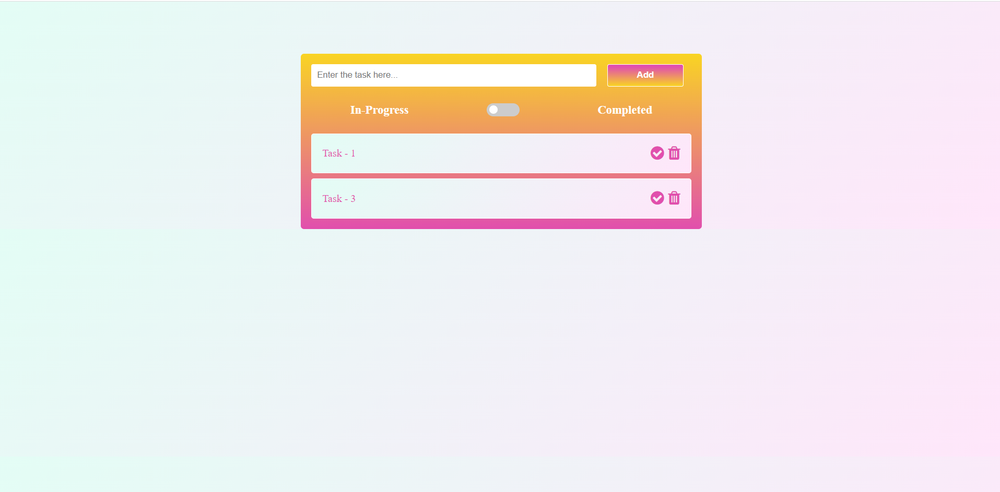
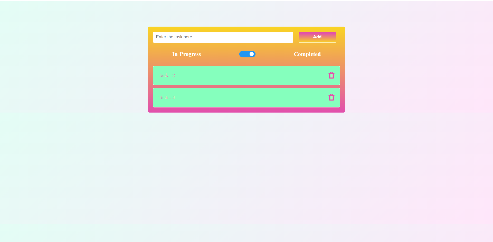

# ToDo app using JavaScript

An exercise project built using JavaScript.

## Features

- Create a Task
- Delete a Task
- Saving the task in browser localstorage

## Screenshots

## Demo

[Demo Site](https://Gokulancv10.github.io/)

## Tech Stack

**Client:** HTML, CSS & JavaScript

